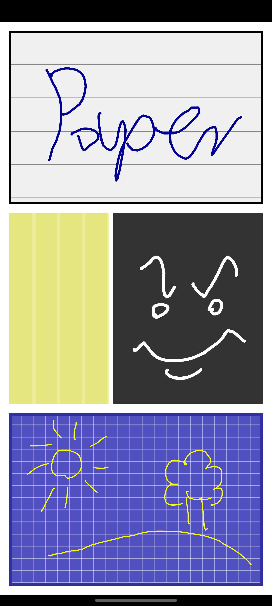

# PaperView
Android View resembling a sheet of paper. PaperView can only be adjusted by using custom XML attributes at this moment. These attributes include colors, stroke type and sizes. SketchyPaperView additionally includes simple drawing implementation.
### Usage
Declaring view in layout:
```xml
    <tw0reck1.paperview.SketchyPaperView
        android:layout_width="match_parent"
        android:layout_height="match_parent"
        android:padding="12dp"
        app:pv_stroke_type="grid"/>
```

### Samples

